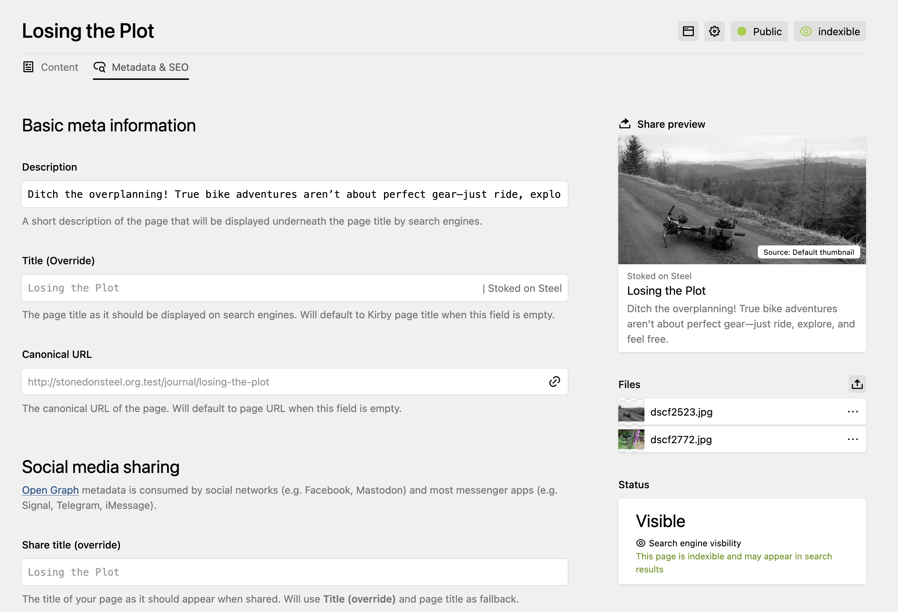

# Meta(data) for Kirby CMS

[Kirby](https://getkirby.com) plugin that handles the generation of meta tags for search engines, social networks, browsers, and beyond. It offers editor-friendly panel controls for your editors while prociding powerful APIs for customizing your developer experience.



**Key features:**

- 🔎 All-in-one solution for SEO and social media optimization
- 📱 Support for OpenGraph and Schema.org (JSON-LD) markup
- 🚀 Customizable metadata for auto-generated metadata from page contents
- 💻 Extensive panel UI including social media previews
- 🦊 Easy-to-understand language in the panel, providing a good middle ground between simplicity and extensive control options.
- 🧙‍♂️ Most features can be enabled/disabled in config, panel UI only shows enabled features (thanks to dynamic blueprints)
- 🤖 Automatic `robots.txt` generation
- 🏎️ Supports non-editable overrides of values for special pages
- 🕵️‍♀️ Stealth mode for staging servers
- 🌍 All blueprints are fully translatable (*English, German, French, Swedish and Dutch translations are included*)

> [!NOTE]
> This plugin is completely free and published under the MIT license. However, if you are using it in a commercial project and want to help me keep up with maintenance, please consider to **[❤️ sponsor me](https://github.com/sponsors/fabianmichael)** for securing the continued development of the plugin.

## Requirements

- PHP 8.4+
- Kirby 5.3.0+

## How it works

The plugin tries to fetch metadata from overrides, page content and default
values and for some values from global and even config defaults. This ensures
that proper metadata is almost always available. This gives editors much freedom
for setting up metadata while giving you full control as a developer.

## Installation & Setup

**Install using composer (recommended):**

```
composer require fabianmichael/kirby-meta
```

**Alternative download methods:**

You can also download this repository as ZIP or add the whole repo as a submodule.
To run from source, you need to install the dependencies : `composer install`.

### Available configuration options

The options below have to be set in your `config.php`. Please note that every option has to be prefixed with the plugin namespace, e.g. `sitemap` => `fabianmichael.meta.sitemap`.

| Key | Type | Default | Description |
|:----|:-----|:--------|:------------|
| `sitemap` | `bool` | `true` | When `true`, will generate an XML sitemap for search engines. The sitemap includes all listed pages by default. ⚠️ If you disable the `robots` setting, no robots.txt will be served to tell search engines where your sitemap is located. |
| `sitemap.detailSettings` | `bool` | `false` | When `true`, the `<changefreq>` and `<priority>` tags are included in the sitemap and their corresponding fields are displayed in the panel. |
| `schema` | `bool` | `true` | Generates [Schema.org](https://schema.org/) markup as [JSON-LD](https://json-ld.org/).
| `social` | `bool` | `true` | Generates [OpenGraph](https://ogp.me/) markup.
| `robots` | `bool` | `true` | Generates the `robots` metatag and serve [robots.txt](https://developers.google.com/search/docs/advanced/robots/intro) at `http(s)://yourdomain.com/robots.txt`.
| `robots.canonical` | `bool` | `true` | Generates canonical url meta tag. Requires `robots` option to be `true`. |
| `robots.index` | `bool` | `true` | Allows crawlers to index pages. Can be overriden in global or page-specific settings from the panel. Requires `robots` option to be `true` for having an effect. If a page is excluded from the sitemap or unlisted, the robots meta tag will always contain `noindex` or `none. |
| `robots.follow` | `bool` | `true` | Allows crawlers to follow links on pages. Can be overriden in global or page-specific settings from the panel. Requires `robots` option to be `true` for having an effect. |
| `robots.archive` | `bool` | `true` | Allows crawlers to serve a cached version of pages. Can be overriden in global or page-specific settings from the panel. Requires `robots` option to be `true` for having an effect. |
| `robots.imageindex` | `bool` | `true` | Allows crawlers to include images to appear in search results. Can be overriden in global or page-specific settings from the panel. Requires `robots` option to be `true` for having an effect. |
| `robots.snippet` | `bool` | `true` | Allows crawlers to generate snippets from page content. Can be overriden in global or page-specific settings from the panel. Requires `robots` option to be `true` for having an effect. |
| `robots.translate` | `bool` | `true` | Allows crawlers offer automated translation of your content. Can be overriden in global or page-specific settings from the panel. Requires `robots` option to be `true` for having an effect. |
| `title.separator` | `string` | `'\|'` | Separator options for the `<title>` tag. |
| `theme.color` | `string\|null` | `null` | If not empty, will generate a corresponding meta tag used by some browsers for coloring the UI. |
| `panel.view.filter` | Provides a filter function for hiding certain pages from the metadata debug view in the panel. See the Kirby docs on [`$pages->filter()`](https://getkirby.com/docs/reference/objects/cms/pages/filter) for details. |
| `stealthMode` | `bool` | `false` | This will force-override all robots settings. You will still get a proper preview in the panel and everything will look like normal, but the robots meta tag will always have a content of none. This is useful for staging servers, where users want to edit content like normal, but you want to ensure that pages will not appear in search engines. The plugin will still generate a sitemap for debugging purposes. |


### Blueprint setup

Your site and page blueprints need to use [tabs](https://getkirby.com/docs/guide/blueprints/layout#tabs), as the plugin's input fields all come in a tab. Meta comes with tab blueprints that need to be added to your site and page blueprints accordingly:

```yaml
# site/blueprints/site.yml
[…]
tabs:
  structure:
    label: Structure
    columns:
      […]
  meta: tabs/meta/site

# site/blueprints/pages/default.yml
[…]
tabs:
  content:
    label: Content
    columns:
      […]
  meta: tabs/meta/page
```

### Template setup

Include the `meta` snippet within your `<head>` element, preferably before
loading any scripts or stylesheets:

```php
<!doctype html>
<html>
<head>
  <?php snippet('meta') ?>
  […]
</head>
[…]
```

Now you are ready to add/edit metadata from the panel.

## Advanced usage

### Default values from page models

Sometimes, you want special behavior for certain templates. The easiest way to achieve this is by creating a page model and implementing a `$page->metaDefaults()` method, that returns an array some or even all of the following keys:

| Property            | Type               | Default | Description |
|:--------------------|:-------------------|:--------|:------------|
| meta_title        | `string`           | `$page->title()` | Provide a default meta title for the page if not set or entered by the user. |
| meta_canonical_url| `string`           | `$page->url()` | Override the default canonical URL for the page. |
| meta_description  | `string`           | `$site->meta_description()` | Provide a default description that is used when the user has not entered a dedicated description for this page. This could e.g. be a truncated version of the page's text content. |
| sitemap_changefreq | `string`           | - | Change frequency for this page in the XML sitemap (e.g. `daily`, `monthly`). |
| sitemap_priority  | `float`            | `0.5` | Sitemap priority, a number between `0.0` and `1.0`. |
| robots_index        | `bool`            | `true` | Whether search engines should index the page. Will fallback to `$site` value or config value if not set. |
| robots_follow       | `bool`            | `true` | Whether search engines should follow links on the page. . Will fallback to `$site` value or config value if not set. |
| robots_archive      | `bool`            | `true` | Whether search engines should archive a cached copy of the page. . Will fallback to `$site` value or config value if not set. |
| robots_imageindex   | `bool`            | `true` | Whether images on the page should be indexed by search engines. . Will fallback to `$site` value or config value if not set. |
| robots_snippet      | `bool`            | `true` | Whether a text snippet of the page is allowed in search results. . Will fallback to `$site` value or config value if not set. |
| robots_translate    | `bool`            | `true` | Whether search engines can offer translation of the page. . Will fallback to `$site` value or config value if not set. |
| og_title          | `string`           | `$page->title()` | Provide a default OpenGraph title for this page. |
| og_description    | `string`           | `meta_description` | Provide a default OpenGraph description. |
| og_image          | `Kirby\Cms\File`   | global `og:image` | A `File` object that sets the default OpenGraph image for this page. You can even generate custom images programatically and wrap them in a `File` object, e.g. for the docs of your product (getkirby.com does this for the reference pages). |
| @graph            | `array`            | - | Things to add to the JSON-LD metadata in the page's head. If you need to reference the organization or person behind the website, use `url('/#owner')`. If you need to reference the website itself, use `url('/#website')`. |
| @social           | `array`            | - | Extend the social meta tags generated by the plugin. |
| lastmod           | `int`              | `$page->modified()` | Override the last modified date used for sitemaps. Unix timestamp expected. |

Here is a starting point for your own page model:

```php
<?php

class ArticlePage extends Page {
  public function metaDefaults(?string $lang = null): array {
       return [
            'meta_title' => null,
            'meta_canonical_url' => null,
            'meta_description' => null,

            'sitemap_priority' => null,
            'sitemap_changefreq' => null,

            'robots_index' => null,
            'robots_follow' => null,
            'robots_archive' => null,
            'robots_imageindex' => null,
            'robots_snippet' => null,
            'robots_translate' => null,

            'og_title' => null,
            'og_description' => null,
            'og_image' => null,

            '@graph' => [],
            '@social' => [],

            'lastmod' => null, // unix timestamp expected
        ];
    },
}
```

### Overrides from page models

Overrides allow you to enforce certain values for specific page models. E.g. you can enforce that a page will always have a certain title or robots setting. Just implement a `metaOverrides()` method on your page model:


```php
<?php

class LegalPage extends Page {
  public function metaOverrides(?string $lang = null): array
  {
    return [
      'robots_index' => false, // this will disble the robots index setting in the panel and always exclude this page from being indexed.
    ];
  }
}
```

#### `meta.jsonld:after` hook

After the Schema.org graph has been generated. This allows you to pass additional data to the array.

```php
return [
  'meta.jsonld:after' => function (
    array $json,
    FabianMichael\Meta\PageMeta $meta,
    Kirby\Cms\Page $page
  ) {
    // add breadcrumb to JSON-LD graph
    $items = [];

    $parents = $page->parents();

    if ($parents->count() === 0) {
      return $json;
    }

    $i = 0;

    foreach ($parents->flip() as $parent) {
      $items[] = [
        '@type' => 'ListItem',
        'position' => ++$i,
        'item' => [
          '@id' => $parent->url(),
          'name' => $parent->title()->toString(),
        ],
      ];
    }

    $json['@graph'][] = [
      '@type' => 'BreadcrumbList',
      'itemListElement' => $items,
    ];

    return $json;
  },
];
```

#### `meta.social:after`

Allows you to alter the OpenGraph card data.

```php
return [
  'meta.social:after' => function (
    array $social,
    FabianMichael\Meta\PageMeta $meta,
    Kirby\Cms\Page $page
  ) {
    // add first video file of page to OpenGraph markup
    if ($page->hasVideos()) {
      $social[] = [
        'property' => 'og:video',
        'content'  => $page->videos()->first()->url(),
      ];
    }
    return $social;
  },
];
```


#### `'meta.sitemap…` hooks

These hooks allow you to completely alter the way how the sitemap is being generated. These functions are meant to manipulate the provided DOM document and elements directly and should not return anything.

```php
return [
  'hooks' => [
    'meta.sitemap:before' => function (
      Kirby $kirby,
      DOMDocument $doc,
      DOMElement $root
    ) {
      // add namespace for image sitemap
      $root->setAttributeNS('http://www.w3.org/2000/xmlns/', 'xmlns:image', 'http://www.google.com/schemas/sitemap-image/1.1');
    },

    'meta.sitemap.url' => function (
      Kirby $kirby,
      Page $page,
      PageMeta $meta,
      DOMDocument $doc,
      DOMElement $url) {

      if ($page->images()->count() === 0) {
        // dynamically exclude page from the sitemap
        return false;
      }

      foreach ($page->images() as $image) {
        // add all images from page to image sitemap.
        $imageEl = $doc->createElement('image:image');
        $imageEl->appendChild($doc->createElement('image:loc', $image->url()));

        if ($image->alt()->isNotEmpty()) {
          $imageEl->appendChild($doc->createElement('image:caption', $image->alt()));
        }

        $url->appendChild($imageEl);
      }
    },

    'meta.sitemap:after' => function (
      Kirby $kirby,
      DOMDocument $doc,
      DOMElement $root
    ) {
      foreach ($root->getElementsByTagName('url') as $url) {
        if ($lastmod = $url->getElementsByTagName('lastmod')[0] ?? null) {
          // remove lastmod date from sitemap entries for some reason …
          $url->removeChild($lastmod);
        }
      }
    },

    'meta.theme.color' => function (
      ?string $color
    ) {
      return '#ff0000';
    }
  ],
];
```

### Manipulating indexed pages
A few helpers are available for manipulating pages:

### Page Method
If you'd like to know if a page is indexed in the sitemap, you can use `$page->isIndexible()` (returns a `bool`).

### Site Method
To get all indexed pages according to your settings, you can use : `$site->indexedPages()` (returns a `Kirby\Cms\Collection` of pages).

## Credits

This is partly based on an older version of the meta plugin, that I had initially
developed for [getkirby.com](https://getkirby.com). I liked the idea so much,
that I wanted to adapt it for general use on other websites.

It took a lot of inspiration (and some code) from other existing Kirby plugins,
like [MetaKnight](https://github.com/diesdasdigital/kirby-meta-knight/)
by [diesdas ⚡️ digital](https://www.diesdas.digital/)
and [Meta Tags](https://github.com/pedroborges/kirby-meta-tags)
by [Pedro Borges](https://github.com/pedroborges).
